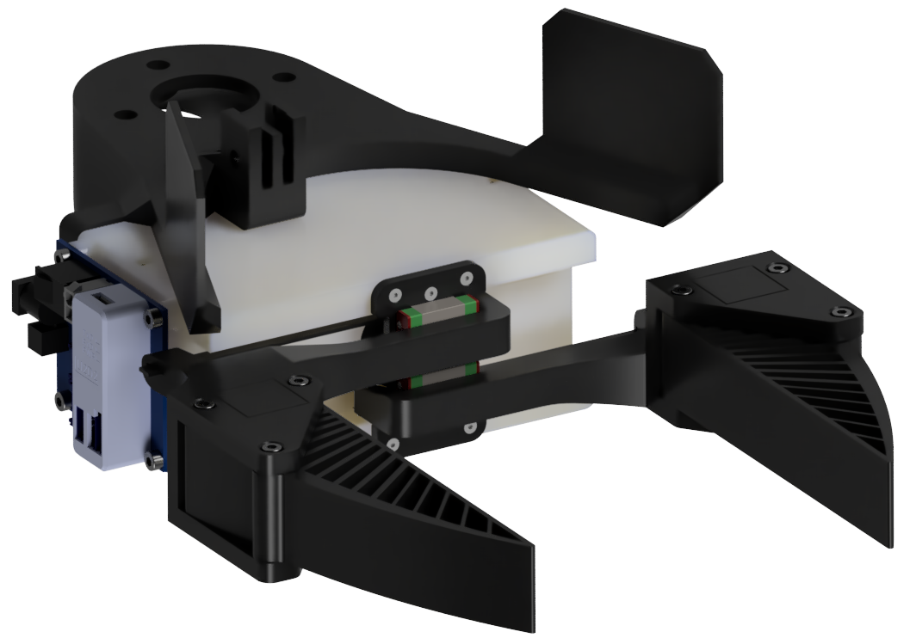

# actuated-umi-gripper


<!-- PROJECT LOGO -->
<br />
<div align="center">
  <a href="https://github.com/actuated-umi/actuated-umi-gripper">
    
  </a>

  <h3 align="center">Actuated UMI Gripper</h3>
  <h5 align="center">Erik Helmut*, Niklas Funk*, Tim Schneider, Jan Peters<br><em>*Equal contribution</em></h5>
  

  <p align="center">
    This repository provides an actuated, open-source version of the popular <a href="https://umi-gripper.github.io">UMI gripper</a>. Designed to be cost-effective and modular, this gripper uses 3D-printed components to ensure accessibility and reproducibility. With a Dynamixel motor for actuation, you can assemble the gripper yourself using the included design files and guidelines. This repository contains the mechanical design files and printable components, enabling you to build and customize the gripper to suit your needs. <br />
    <a href="https://actuated-umi.github.io"><strong>For more information about actuated-UMI, visit the project page »</strong></a> <br />
  </p>
</div>


```
@inproceedings{helmut2024actuatedumi,
  author = {Helmut, Erik and Funk, Niklas and Schneider, Tim and Peters, Jan},
  title = {Actuated Version of the Universal Manipulation Interface Gripper},
  year = {2024},
  url  = {https://actuated-umi.github.io/}
}
```

<!-- TABLE OF CONTENTS -->
<details>
  <summary>Table of Contents</summary>
  <ol>
    <li>
      <a href="#bill-of-materials-bom">Bill of Materials (BoM)</a>
    </li>
    <li>
      <a href="#3d-printing-details">3D Printing Details</a>
    </li>
    <li>
      <a href="#assembly-guide">Assembly Guide</a>
    </li>
    <li>
      <a href="#usage">Usage</a>
    </li>
    <li>
      <a href="#acknowledgements">Acknowledgements</a>
    </li>
    <li>
      <a href="#license">License</a>
    </li>
    <li>
      <a href="#questions-and-contributing">Questions and Contributing</a>
    </li>
  </ol>
</details>


<!-- Bill of Materials -->
## Bill of Materials (BoM)
To build the actuated UMI gripper, you will need the following components. The list includes all necessary parts, along with links to purchase them online.

| Item                          | Quantity | Link                                                                 |
|-------------------------------|----------|----------------------------------------------------------------------|
| DYNAMIXEL XL430-W250-T              | 1        | [MyBotShop](https://www.mybotshop.de/DYNAMIXEL-XL430-W250-T)                        |
| ROBOTIS DYNAMIXEL U2D2              | 1        | [MyBotShop](https://www.mybotshop.de/ROBOTIS-DYNAMIXEL-U2D2)                        |
| ROBOTIS DYNAMIXEL U2D2 POWER HUB              | 1        | [MyBotShop](https://www.mybotshop.de/ROBOTIS-DYNAMIXEL-U2D2-Power-Hub)                        |
| Constant Force Spring (0.1x8x110)              | 2        | [AliExpress](https://de.aliexpress.com/item/1005002310168061.html?spm=a2g0o.order_list.order_list_main.64.7189180257OJ3W&gatewayAdapt=glo2deu)                        |
| Linear Rail & Carriage (80mm - MGN7C)              | 2        | [AliExpress](https://de.aliexpress.com/item/1005004432783865.html?spm=a2g0o.productlist.main.51.3fed343312uN3O&algo_pvid=62d66ac1-59b2-4760-bc39-4d4fba31f686&algo_exp_id=62d66ac1-59b2-4760-bc39-4d4fba31f686-25&pdp_npi=4%40dis!EUR!42.03!20.17!!!44.13!21.18!%40210385a817152515425412601ea383!12000029165549427!sea!DE!0!AB&curPageLogUid=fnOmJDOEyGje&utparam-url=scene%3Asearch%7Cquery_from%3A)                        |
| Flat Belt (width 5mm, thickness 1mm, length 300mm)              | 1        | [KeilriemenExpress](https://www.keilriemenexpress.de/weitere-produkte/flachriemen-t150/neoprene-29306.html)                        |
| Heat Sets              | 1        | [Amazon](https://www.amazon.de/Gewindeeinsatz-Einpressmutter-Gewindebuchsen-Kunststoff-Box-Kunststoffteiledurch/dp/B09B7F2XM3/ref=sr_1_6?dib=eyJ2IjoiMSJ9.4sekI893jS_Bk71L9U9_X0O_zMoZzuLUK5ldKbxMZCY_a7cMJM-6afJxnikKvfGc8qwsDTMBoi3QITAiA3lfOBWOgJTzv-ZprExNekG-2XzD7JNX1f1pNCZe_alHPoBhoYXUohRg69wfFe1woOdFZMUpc9hoOKwri_3luj8jyjWtAQg_VlQm3zxWOmgDc168gt1VxEOlfS7OJ1epzQDI5IakgzEF8b-6CWUrjhULSaU-28hd30Lc1vMM_ZG4StV6vFbPElMNAxlawWusBCc5UqOem1KSq2TfmyMlXdEC0wI.j0Bo6_IqzFKq3gLZMBMitr8gIcdklCOfCxIpVdsbU6M&dib_tag=se&keywords=gewindeeinsatz%2B3d%2Bdruck&qid=1734960428&sr=8-6&th=1)                        |
| Cylindrical Head Screws & Nuts (M3)             | 1        | [Amazon](https://www.amazon.de/Sechskopf-Knopf-Zylinderschrauben-Gewindeschrauben-Sechskantschrauben-Maschinenschrauben/dp/B0B3MGZ7T2/ref=sr_1_6?__mk_de_DE=ÅMÅŽÕÑ&crid=2AKHUVV2YXU0R&dib=eyJ2IjoiMSJ9.Gr0nOLkGHe8tC7VVlCThbb-3XEpHcX-eWT53-YGcYCqxmfHRqyxQLlBbVedU2xbw7nP-bcgj16am2vRgFkklYlSRtz3UCmgdAbns-Q1GhsDcldaA-3Puam8GKie6pPorMDHJwOL2cOysa3R_sP7CG7DVoxLh-96c7eJ_UxtuZCTM8XhOxgb_WTXR_o_CSQl1SargHb3wQWcaPaLm3-gPLkItAvxHlmyiryJryzrxORqWLVMNvA3O3HU5WPSbSJvE5MbQQ0Ben3iprgAdZbD7leyK8TchqTifKjEYljH00C23uNk1ystsyp9U24Gqirlc7gRdRJsspQR60bryparifMY5C1GV1TeXAIPXu3wbRVCFtpicU6AtxQ9DqY7fKWFWpiEUZiY6qYQhPYT9wVg1EHDFCk71AVnBrrAe34FDk-DPz8iuSDiNOT6HQFQlxaEw.pLT4ZCgQSOE5yQdMa6NFprSqQCqqWs3QW83IuaejpdI&dib_tag=se&keywords=m3x40&nsdOptOutParam=true&qid=1734961433&sprefix=m3x40%2Caps%2C150&sr=8-6&th=1)                        |
| Flat Head Screws (M2)            | 1        | [Amazon](https://www.amazon.de/Innensechskantschrauben-Unterlegscheiben-Senkkopfschraube-Maschinenschrauben-Zylinderschrauben/dp/B0C6ZC3LB8/ref=sr_1_27?dib=eyJ2IjoiMSJ9.7PvJKvqBZH7hVnYl7pKXA9cgrxU_nm1wre4PKdY5OJTMxMrThoKd995BiTKHbnYga4fbMKcT9NS6BjnVluuRinJH1QK_z0xNBjUkeOzry85WL08fAxM5X_zU6xDsne5-z-w0ptOvHgPsaaC77Bq3B6TIx4ci6NCHBrpOJV4tswlYbRK1rzfKh-FSyj9B1xydr82KyZmotVOvxjoo-QpeDZsbEV3MsMxY0vajb4vYXVfFz598-qiqPhE_e7IvezZ8Iu9pZu_C6azvq8g5DrJprt2fYfcTDhC9phMplDw5zZro4eGtprjAouuQUPkHa2thGM3bLHy_2d6ym-nen4JV3tBwS5MYJZsSgdy3jsldLLpwYJyh5hvPflEhlP1hUMJYuKDUTGDZ0OdEjIW4oEqln-6PiQwQ8RgZRRv9-axCjP8j5kFweJnvSTicy5HjWvSH.5x2ivUpoZF_ByQ6ryH1OxLnK1ZRAe0FGou8HA0vmqNw&dib_tag=se&keywords=senkschrauben%2Bm2&nsdOptOutParam=true&qid=1734961739&sr=8-27&th=1)                        |


<!-- 3D Printing Details -->
## 3D Printing Details
The gripper consists of several 3D-printed components that you can print yourself using a common FDM 3D printer with a standard nozzle diameter of 0.4 mm. We provide the design files for each component in the [`3d-printables`](3d-printables/) folder. The components are designed to be printed with PLA or similar materials. For all parts, we suggest using the infill pattern "Cubic" and adhesion method "Brim" to ensure optimal print quality and stability. We recommend the following settings for each 3D-printed component:

| Part Name                | Layer Height | Wall Thickness | Top/Bottom Thickness | Infill | Support | Quantity |
|--------------------------|--------------|----------------|----------------------|--------|---------|----------|
| [Gripper Carriage Mount](3d-printables/actuated-UMI-gripper-carriage-mount.stl)               | 0.2 mm       | 1.2 mm         | 1.2 mm               | 100%    | No      | 1        |
| [Gripper Structure](3d-printables/actuated-UMI-gripper-structure.stl)              | 0.2 mm       | 2.4 mm         | 1.2 mm               | 40%    | Yes     | 1        |
| [Jaw Left](3d-printables/actuated-UMI-jaw-left.stl)             | 0.2 mm       | 2.4 mm         | 1.2 mm              | 40%    | Yes      | 1        |
| [Jaw Right](3d-printables/actuated-UMI-jaw-right.stl)          | 0.2 mm       | 2.4 mm         | 1.2 mm               | 40%    | Yes     | 1        |
| [CF Sprint Idler](3d-printables/OpenGrip-cf-spring-idler.stl)      | 0.2 mm       | 1.2 mm         | 1.2 mm              | 100%    | No      | 2
| [Gripper Drive Pulley](3d-printables/OpenGrip-gripper-drive-pulley.stl)              | 0.2 mm       | 1.2 mm         | 1.2 mm               | 100%    | Yes      | 1
| [Gripper Fingers](3d-printables/UMI-gripper-soft-gripper-finger.stl)              | 0.2 mm       | 1.2 mm         | 1.2 mm               | 40%    | No      | 2       |
| [Franka Gripper Mount](3d-printables/UMI-wsg50-franka-mount-gripper-mount.stl)               | 0.2 mm       | 1.2 mm         | 1.2 mm               | 40%    | No      | 1        |

Note: If you want to print the fingers with TPU, please follow the setting from the [UMI Gripper](https://umi-gripper.github.io) hardware guide.


<!-- Assembly Guide -->
## Assembly Guide
We provide a comprehensive, step-by-step assembly guide to help you build the gripper with ease. The video tutorial walks you through each step, ensuring a clear and straightforward assembly experience. You can find the video tutorial below:

<a href="https://www.youtube.com/watch?v=XodgLZ3qirM">
    
  </a>


<!-- Usage -->
## Usage
To use the gripper after it is fully assembled, you will need the appropriate software to control it. We recommend using the [Dynamixel API](https://github.com/TimSchneider42/dynamixel-api) developed by our team. This API provides a comprehensive set of tools and functions to interface with Dynamixel motors, which are used in the actuated UMI gripper.

The repository includes detailed instructions on how to install and use the API, as well as example code to get you started. By following the guidelines provided in the Dynamixel API repository, you can easily integrate the gripper into your projects and control its movements programmatically.


<!-- Acknowledgements -->
## Acknowledgements
This work heavily builds upon the following prior efforts. It would not have been possible without them.

- C. Chi, Z. Xu, C. Pan, E. Cousineau, B. Burchfiel, S. Feng, R. Tedrake, and S. Song, "Universal Manipulation Interface: In-The-Wild Robot Teaching Without In-The-Wild Robots," in Proc. Robotics: Science and Systems (RSS), 2024. We used the [UMI Gripper](https://umi-gripper.github.io) as a key reference for our design, aiming to closely replicate its functionality and form. 
- Clayton Haight, creator of [OpenGrip](https://github.com/clayhaight01/OpenGrip). The OpenGrip gripper mechanism served as the initial design starting point for our own gripper development.
- Stan Markwell, for providing CAD files of the ROBOTIS U2D2 Power Hub Board & U2D2, available on [GrabCAD](https://grabcad.com/library/robotis_u2d2_power_hub_board-1).


<!-- License -->
## License
This project is licensed under the MIT License. However, it incorporates third-party content, which retains its original license terms. Details are as follows:

- **Third-Party Content**: Portions of this project include content from [UMI Gripper](https://umi-gripper.github.io) licensed under the MIT License. The original license file for these materials can be found in [LICENSE_THIRD_PARTY](LICENSE_THIRD_PARTY).

- **Your Contributions**: All other content in this project, created by [Actuated-UMI](https://actuated-umi.github.io), is licensed under the MIT License. You can find the license file for this project in [LICENSE](LICENSE).

For clarity:
- You are free to use, modify, and distribute this project under the terms of the MIT License.
- Please ensure compliance with the license terms for the included third-party content.


<!-- Questions and Contributing -->
## Questions and Contributing
If you have any questions or need help with building the gripper, please create an <a href="https://github.com/actuated-umi/actuated-umi-gripper/issues/new/">issue</a>.

We also welcome contributions to this repository, including new 3D models or other improvements. If you would like to contribute, please <a href="https://github.com/actuated-umi/actuated-umi-gripper/fork">fork</a> this repository and submit a <a href="https://github.com/actuated-umi/actuated-umi-gripper/compare">pull request</a> with your changes, or reach out to erik.helmut1 [at] gmail [dot] de.
